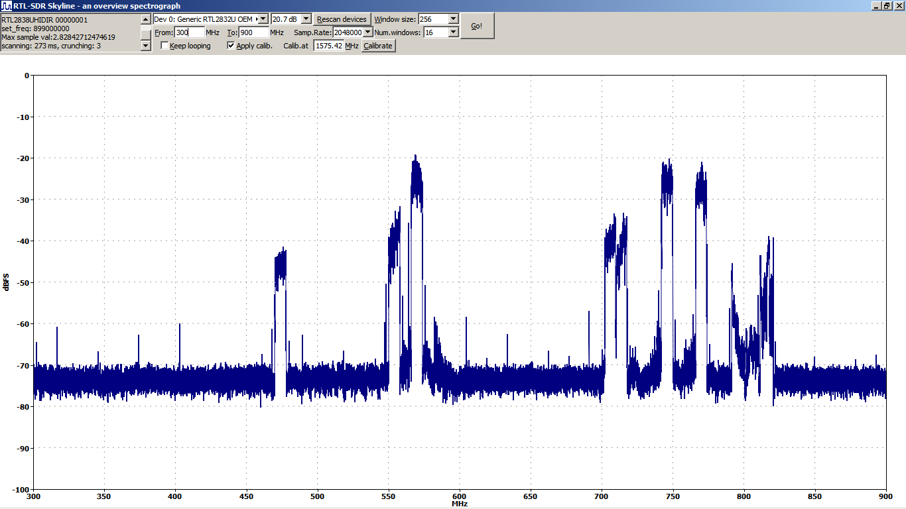

# RTL-SDR Skyline

RTL-SDR Skyline is a broadband overview spectrograph, AKA a band scanner, using RTL-SDR dongles for its radio input. 

It is written in C++, aiming to be compact and fast. While it was originally developed in Windows, it's written in Ultimate++ with a hope that it would be easily portable.

## Screenshot

  
A screenshot of rtlsdr_skyline.exe in action

## Download

Download the latest binary build for Windows from [link TBD](rtlsdr_skyline-bin.zip).  
The source code lives at [GitHub](https://github.com/xrysf03/rtlsdr_skyline.git). 

## Dependencies

You will need a copy of the rtlsdr.dll/librtlsdr.dll.  
Until/unless someone complains, I am including one in the ZIP with the binary build of my Skyline.

Further dependencies for the prebuilt Windows binary and for building from source code:

### Windows binary

You need to download [ZADIG](https://zadig.akeo.ie/) to install libusb-Windows for you (a generic driver + wrapper library, allowing you to access USB devices from the user space) . Apparently, you **do not need to** download [Libusb-Windows](https://libusb.info/) explicitly / on your own.

### Source code

You need the public header files of librtlsdr, called rtl-sdr.h and rtl-sdr_export.h. They may have come included in a [binary distribution ZIP](https://osmocom.org/projects/rtl-sdr/wiki/Rtl-sdr#Binary-Builds) with (lib)rtlsdr.dll (apparently no longer the case), or you can get them from the [GIT repo of librtlsdr](https://github.com/steve-m/librtlsdr/tree/master/include).

## Installation

### Pre-built Windows binary

The pre-built binary does not have an installer, and is "portable".  
Just unzip the distribution archive someplace (including the DLL's) and run rtlsdr_skyline.exe.

When installing [ZADIG](https://zadig.akeo.ie/) and getting it to load drivers, there's one typical pitfall to know about:  
On your first encounter, you typically find out that the ultra-classic RTL2832U dongle does not get properly recognized. The one with a USB PID = 2838. It probably has to do with the fact that the RTL2832U presents a "USB composite device" = advertises itself as a bunch of virtual USB devices, and in the device manager it appears as a parent node with a couple of child nodes (= an expandable node in the device tree, if you choose the view "devices by connection"). Maybe Windows nowadays even have a generic pseudo-driver for the "composite parent" devices... which is probably not the problem itself.  
The problem apparently is, that ZADIG comes configured *not* to show composite parent devices - thus, your dongle becomes obscured from view. And it is that composite parent device, for which you load the libusb shim driver (not the virtual subdevices). To have your dongle offered by ZADIG, go to Options and **un**check "Ignore Hubs or Composite Parents". (And, keep "List All Devices" chacked.) [Follow this guide](https://www.rtl-sdr.com/forum/viewtopic.php?t=2031) for helpful screenshots of where that check-mark is and what the dongle's entry in ZADIG's device list should look like.

### Source code

You need to [download and install Ultimate++](https://www.ultimatepp.org/). At the time of this writing, you can just unpack a nightly build someplace convenient (such as /Program Files/ in Windows). Unless you have or want MSVC, Ultimate++ in Windows installs its own copy of MinGW, which works just fine for building Windows apps.

After you've made yourself at home a little, you need to get the source of RTL-SDR Skyline and unpack that someplace convenient, I suggest to put it in a subdirectory under UPP/MyApps/ (for a start), and tell U++ TheIDE to load the project.

Note that in U++, include directories and lib directories are not per-project configuration, but global config (perhaps unless you define your own makefile or something). So you need to configure those paths on your own, in Setup -> Build Methods. And if you have just a DLL (rtlsdr.dll) and not a corresponding .lib for MinGW, you can include the DLL directly without a .lib, but you probably have to mention the DLL file including a full path in the row labeled "Common link options" - which also happens to be available in package configuration (via the Package Organizer). (Corrections welcome. I haven't found a better way. I'm a noob to U++.)

The KISS FFT within U++ is a "contributed package", placed in the bazaar/plugins subdirectory. It does not become available to your project automatically - you have to add that component to the rtlsdr_skyline project, and you may need some extra steps before that even becomes available. Check out [this U++ forum topic](https://www.ultimatepp.org/forums/index.php?t=msg&goto=53043&#msg_53043).

While in the main IDE screen (editor), remember to toggle the build method to MINGW Release (rather than Debug). Unless you know better of course :-)  
Also note that upon a first compilation, U++ compiles all the components and core libraries from source. On later rebuilds (when hacking at your own project), these are not rebuilt ever time... Only when you toggle or reconfigure the build method.

## Bugs etc.

The initial release, while I consider it a beta, should be pretty stable and useable at what it does.  
It has only been tested (compilation and operation) under Windows 7. Test reports under different OS versions are welcome.

### Principal downsides and limits

RTL-SDR Skyline works around the limited bandwidth of the RTL-SDR reception method (approx 2 MHz) by tuning into a sequence of frequencies and combining the partial consecutive 2 MHz spectra into a broader-band aggregate picture. It does not have the power to listen to the whole aggregate spectrum all the time.

Note that this is in contrast to most (RTL-)SDR apps that *do* stick to a single frequency, and only show about +/- 1 MHz around the carrier. And are therefore unuseable for "overview" purposes, such as checking for TV transponders in your area.

You need to be aware of this "sequential scanning" behavior when watching a "moving" signal, such as a frequency-hopping GSM phone or a sweeping signal generator / frequency-domain reflectometer. The result you get is semi-random / intermittent spectral images, stroboscopic effects, signal amplitudes less than expected and the like. You need to know what you're doing :-)

The RTL-SDR dongle produces about 2M I+Q complex samples per second - with 8-bit resolution (unsigned & DC-shifted into the middle of the ADC range, which is like signed with a flipped sign bit). And the 8-bit signal depth limits dynamic range = the ratio between the strongest and weakest signal that you can observe simultaneously. The maximum possible range is about 60-70 dBFS, which is more than the raw digital lsb math would suggest (48 dB) - apparently, to a degree, the statistical math behind the FFT (averages) can extract signals weaker than the quantising noise. Longer FFT windows are better at this. Other than that, the dongles typically have a gain range of 40-50 dB. Not sure if the following is correct, but that would put the theoretical total sensitivity down to -100 to -120 dBmW.

### Todo

= stuff that I'd love to do but have no time for, at the moment

The current version (initial release) runs in a single thread. The scanning is done in GUI handlers. I.e., while the scanning activity is going on (tuning, data RX, FFT), the GUI is numb. The code actually has to call Ctrl::ProcessEvents() when updating data in the chart, to achieve gradual update while scanning.  
This sorely needs a split into two or three threads: The GUI front-end thread and one or two back-end threads. The main motivation here is a more responsive and flexible GUI. At the back end, tuning and data RX could be done in parallel with FFT processing of the previous "partial channel" - but this "back-end split" is nowadays not critically needed, as the FFT takes only about 10% of time, compared to the tuning, settling and data reception.

The amplitude in the chart is given in deciBel under Full Scale. A full scale unclipped Sine Wave should result in a reading of -3 dBFS.  
It would be nice to have the readings scaled to dBmW @ 50 Ohm. Just taking the configured gain into account may not be enough, some actual calibration would be appropriate.

It is easy to detect clipping. Internally the code actually does contain a basic check, and reports "maximum amplitude" into the log box (per channel scanned). It would be nice to have some kind of a visual clipping indicator, such as a colored bar along the horizontal edge of the chart. This would have to be implemented parallel to the ScatterCtrl widget - or maybe as a second series in the chart (scaled on the y2 axis), which would possibly compromise clarity of the readings... The ScatterCtrl doesn't seem to implement e.g. changing background color in a fractional area (rectangle) according to an aditional data series.

### Wishlist

* configuration save/load (file-based)
* more work on channel filter calibration, maybe with an option 
  to save the curves to a file. The trouble is that the channel
  response depends on a number of variables... frequency, gain,
  maybe actual signal amplitude as well...
* recording of scan data into a file, including continuous mode,
  with support for geolocation metadata

Just look at what RTLSDR Scanner can do (and more).

* how about a sibling project that could use two RTL-SDR dongles with comparison of the spectra for a scalar filter analysis ?

## Credits

Credit where credit is due:

[RTLSDR Scanner](https://eartoearoak.com/software/rtlsdr-scanner) by Al Brown / Ear to Ear Oak.  
Al Brown is my hero, and a true pioneer. While feature-complete and neatly designed, his scanner is "nearly there" in terms of being a little bloated, and dependent on Python, which itself was a (well I'd like to be polite) at some times in its history. This was my main motivator to try writing something at my own terms.

The [RTL-SDR Library](https://osmocom.org/projects/rtl-sdr/wiki/Rtl-sdr) by Steve Markgraf of the OSMOCOM project.  
He is the principal founder of the whole RTL-SDR ecosystem.  
In Windows, librtlsdr.dll uses [Libusb-Windows](https://libusb.info/) which gets installed by [ZADIG](https://zadig.akeo.ie/).

[Ultimate++](https://www.ultimatepp.org/) the GUI RAD tool and IDE - by [Mirek, Iñaki and their team. They're BSD-licensed](https://www.ultimatepp.org/app$ide$About$en-us.html), open source, lean and actually *pretty rad*.  
Namely the spectrogram chart is implemented using the [ScatterCtrl](https://www.ultimatepp.org/src$ScatterCtrl$ScatterCtrl_en-us.html) component, and the FFT engine under the hood is using the [KISS FFT](https://github.com/mborgerding/kissfft) by Mark Borgerding as included in the U++ source tree (bazaar/plugin section).

## Author
Stitched together by:  
Frank Rysanek [ Frantisek DOT Rysanek (AT) post DOT cz]

## License

[Something BSD style](LICENSE.txt) Check the U++ License if you need more detail.

The RTL-SDR library is licensed under GPL v2. It is not linked in static form to the Skyline binary, nor is it directly included in the source form. The Skyline uses librtlsdr.dll as a dynamically linked object. I do include the library in binary form in the ZIP archive with the pre-built Skyline binary, linked for download above. Please complain if this is a problem.